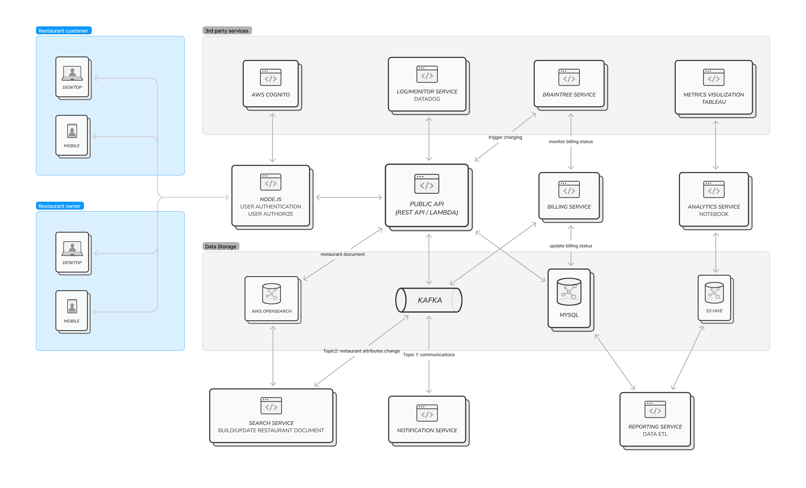
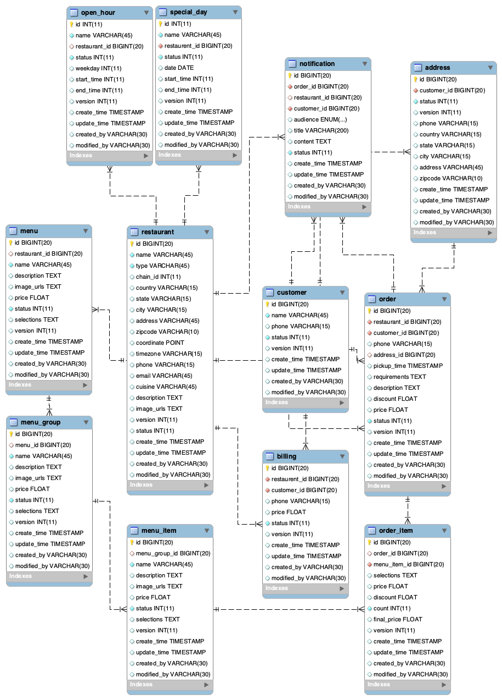

# Food Delivery System

This is to design the backend of a food delivery application with basic features like search, order, billing, and notify.

## Architecture

The system contains seven services, which are summarized in the following table

| Service      | Function                                                        |
|--------------|-----------------------------------------------------------------|
| Node.JS      | Handles user authentication and authorization                   |
| Public API   | Provides backend API service                                    |
| Search       | Create/update restaurant document in OpenSearch server          |
| Billing      | Monitors status of ongoing charging and updates the bill status |
| Notification | Sends email, sms to customers and restaurants about order       |
| Reporting    | ETL pipeline to prepare/archive data                            |
| Analytics    | Used by analytics team                                          |

Possible extensions: user/restaurant comments/ranking, advertise service

The following first lists proposed DB tables and APIs. Then explains how the challenges are addressed.

## MySQL model

## API
The REST API needs to support GET/UPSET/DELETE operations on the following entities:
- restaurant
- open_hour
- special_day
- menu
- customer
- address
- order
- billing
- notification

## Challenges

The challenges include:
### How to search restaurants
- List all the restaurants in your city
- Apply multiple filters (distance radius, opening hours, cuisine etc.)
- Ability to search restaurants by a food item (e.g. pizza)

The search will be implemented by using elastic search. 
Each time API receives updates related to restaurants, a message will be sent to the Kafka queue. Search service will consume the messages and create/update restaurant documents in ES.

### Order and checkout
- Order items from a restaurant (only order from one restaurant at a time)
- Perform billing and checkout

Those are implemented by calling PayPal braintree service. The service can process bill and distribute charges to merchants automatically.
A billing service is implemented to monitor the status of charging and update the charging status.

### Communication and track
- Back and forth communication with restaurants (e.g. if restaurant is not able to process an order after it is placed)
- Ability to track an order (possibility to integrate with third party)

Both customer and restaurant can receive notification, start chats, and check order status.
Notification service will retrieve notifications from Kafka queue and handle the notification job.
